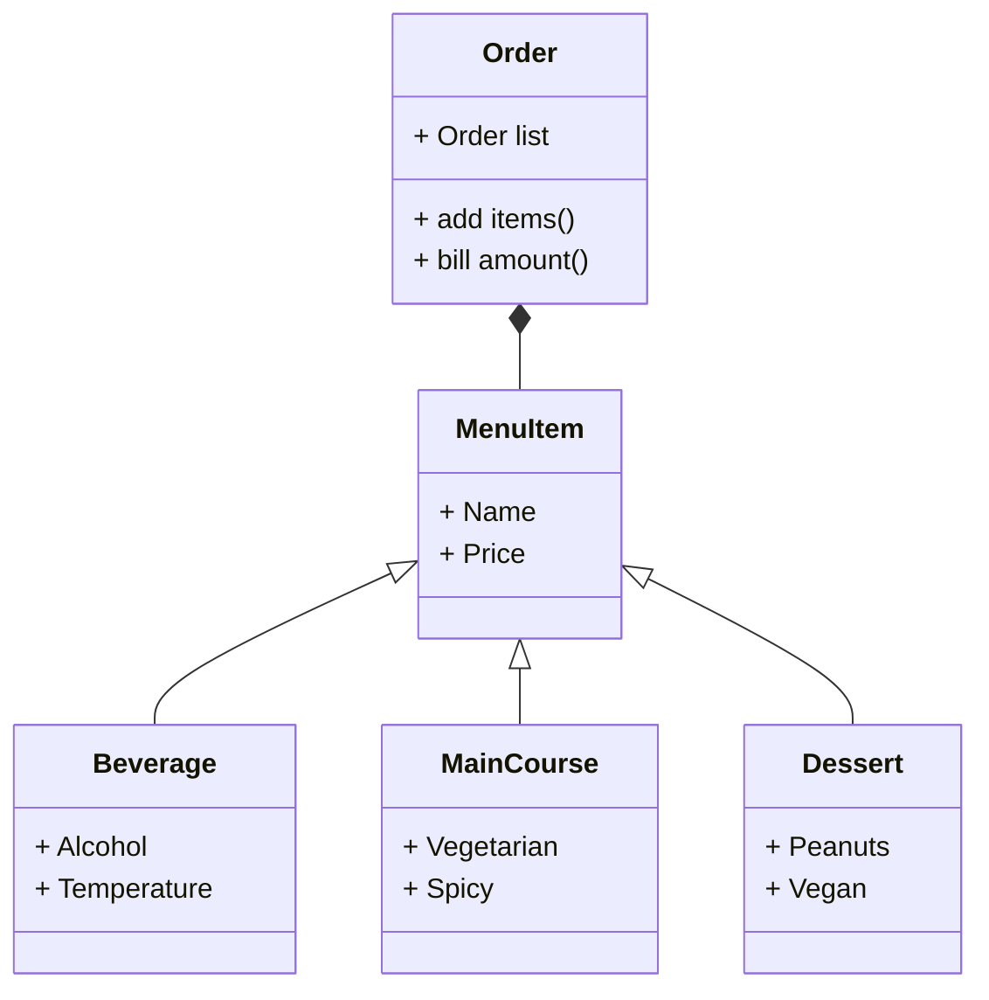

# Reto tres

## Punto uno
Hacer el ejercicio de la clase.

**Ejercicio**
1. Create class Line.
* length, slope, start, end: Instance attributes, two of them being points (so a line is composed at least of two points).
* compute_length(): should return the line´s length
* compute_slope(): should return the slope of the line from tje horizontal in deg.
* compute_horizontal_cross(): should return if exists the intersection with x-axis
* compute_vertical_cross(): should return if exists the intersection with y-axis
2. Redefine the class Rectangle, adding a new method of initialization using 4 Lines (composition at its best, a rectangle is compose of 4 lines).

**Código**
```
class Point:
    def __init__(self, x:float, y:float):
        self.x = x
        self.y = y

class Line:
    def __init__(self, start: Point, end: Point):
        self.start = start
        self.end = end

    def compute_length(self):
        self.length = ((self.start.x-self.end.x)**2+(self.start.y-self.end.y)**2)**(1/2)
        return (self.length)
    #The length is computed considering the distance between two points formula: ((x2-x1)^2+(y2-y1)^2)^0.5
    
    def compute_slope(self):
        vertical_change = (self.start.y-self.end.y)
        horizontal_change = (self.start.x-self.end.x)
        if (self.start.x-self.end.x)==0:
            return "The line is vertical, hence the slope is undefined."
        else:
            self.slope = vertical_change/horizontal_change
            return "The line's slope is: " + str(self.slope)
    #The slope is computed taking into account that it is found by dividing the vertical change (rise) by the horizontal change (run)
    
    def compute_vertical_cross(self):
        if (self.start.x-self.end.x)==0:
            return("The line is vertical, hence it has no y-intercept")
        else:
            self.intercept_y = self.start.y-(self.slope*self.start.x)
            #The method to calculate the intercept is based on the formula: y=mx+b, where b is the y-intercept
            if self.intercept_y>=self.start.y and self.intercept_y<= self.end.y or self.intercept_y<=self.start.y and self.intercept_y>=self.end.y:
                return "It exists the intersection with y-axis"
            #When the y-intercept is between the start point (y-coordinate) and the end point (y-coordinate) of the line, the intersection exists
            else:
                return "It doesn't exist the intersection with y-axis"
            
    def compute_horizontal_cross(self):
        if (self.start.x-self.end.x)==0:
            self.intercept_x = self.start.x
        #When the line is vertical, the x-intercept is the same as the x-coordinate of the points
        elif self.slope==0:
            return "It doesn't exist the intersection with x-axis"
        #When the line is horizontal, there is not intersection with x-axis
        else:
            self.intercept_x = -self.intercept_y/self.slope
        #The method to calculate the intercept is based on the formula: y=mx+b, where y=0 and b=y-intercept
        if self.intercept_x>=self.start.x and self.intercept_x<= self.end.x or self.intercept_x<=self.start.x and self.intercept_x>=self.end.x:
            return "It exists the intersection with x-axis"
            #When the x-intercept is between the start point (x-coordinate) and the end point (x-coordinate) of the line, the intersection exists
        else:
            return "It doesn't exist the intersection with x-axis"

class Rectangle:
    def __init__(self, method:int, *args):
        if method==1:#The rectangle is initialized with the bottom-left corner(Point), the width and the height
            self.bottom = Point(args[0], args[1])#args[0]=bottom left corner x-coordinate and args[1]=bottom left corner y-coordinate
            self.width = args[2]
            self.height = args[3]
        elif method==2:#The rectangle is initialized with the center(Point), the width and the height
            self.bottom = Point(args[0]-(args[2]/2), (args[1]-(args[3]/2)))#The center coordinates are turned into bottom left corner coordinates
            self.width = args[2]
            self.height = args[3]
        elif method==3:#The rectangle is initialized with two opposite corners(Points)
            if args[0]<args[2]:#When the x-coordinate of the first point is less than the one of the second point given by the user
                self.width = (args[2]-args[0])#width is the x-coordinate of the second point given minus the x-coordinate of the first point
                if args[1]<args[3]:#When the y-coordinate of the first point is less than the one of the second point given by the user
                    self.bottom = Point(args[0], args[1])#The bottom left corner has the same coordinates as the first point given 
                    self.height = (args[3]-args[1])#height is the y-coordinate of the second point given minus the y-coordinate of the first point
                else:
                    self.bottom = Point(args[0], args[3])#The bottom left corner has the x-coordinate of the first point and the y-coordinate of the second one
                    self.height = (args[1]-args[3])#height is the y-coordinate of the first point given minus the y-coordinate of the second point
            else:
                self.width = (args[0]-args[2])#width is the x-coordinate of the first point given minus the x-coordinate of the second point
                if args[1]<args[3]:#When the y-coordinate of the first point is less than the one of the second point given by the user 
                    self.bottom = Point(args[2], args[1])#The bottom left corner has the x-coordinate of the second point and the y-coordinate of the first point
                    self.height = (args[3]-args[1])#height is the y-coordinate of the second point given minus the y-coordinate of the first point
                else:#
                    self.bottom = Point(args[2], args[3])#The bottom left corner has the same coordinates as the second point given 
                    self.height = (args[1]-args[3])#height is the y-coordinate of the first point given minus the y-coordinate of the second point
        elif method==4:#The rectangle is initialized with four lines
            #There is a specific order to insert the lines; the 1st line is the bottom edge, the 2nd is the right edge, the 3rd the upper edge and the 4th the left edge.
            self.bottom = Point(args[0].start.x, args[0].start.y)#The bottom left corner is the same as the start point of the first line
            horizontal_line = args[0]#args[0]=line one=bottom edge
            vertical_line = args[1]#args[1]=line two=right edge
            self.width = (horizontal_line.compute_length())
            self.height = (vertical_line.compute_length())

    def compute_area(self):
        print("El área es " + str(self.width*self.height))
    
    def compute_perimeter(self):
        print("El perímetro es " + str(self.width*2+self.height*2))

    def compute_interference_point(self, Point):
        isInside = Point.x>=self.bottom.x and Point.x<=(self.width+self.bottom.x) and Point.y>=self.bottom.y and Point.y<=(self.height+self.bottom.y)
        print(isInside)

class Square(Rectangle):
    def __init__(self, method:int, *args):
        super().__init__(method, *args)

point = Point(-8,-2)
rectangle_one = Rectangle(1, -10, -4, 10, 6) #method, bottom-left.x, bottom-left.y, width, height
rectangle_two = Rectangle(2, -5,-2,10,8) #method, center.x, center.y, width, height
rectangle_three = Rectangle(3, 8,-2,-4,8)#method, opposite1.x, opposite1.y, opposite2.x, opposite2.y
rectangle_four = Rectangle(4, Line(Point(-2,-2), Point(2,-2)), Line(Point(2,-2), Point(2,1)), Line(Point(2,1), Point(-2, 1)), Line(Point(-2,1), Point(-2,-2)))#method, line 1(bottom edge), line 2(right edge), line 3(upper edge), line 4(left edge)
square = Square(3,-4,8,4,0)

rectangle_one.compute_area()
rectangle_one.compute_perimeter()
rectangle_one.compute_interference_point(point)

rectangle_two.compute_area()
rectangle_two.compute_perimeter()
rectangle_two.compute_interference_point(point)

rectangle_three.compute_area()
rectangle_three.compute_perimeter()
rectangle_three.compute_interference_point(point)

rectangle_four.compute_area()
rectangle_four.compute_perimeter()
rectangle_four.compute_interference_point(point)

square.compute_area()
square.compute_perimeter()
square.compute_interference_point(point)


line = Line(Point(-50,-20), Point(10,10))

print(line.compute_length())
print(line.compute_slope())
print(line.compute_vertical_cross())
print(line.compute_horizontal_cross())
```
## Punto dos
**Restaurant scenario**

You want to design a program to calculate the bill for a customer's order in a restaurant.
* Define a base class MenuItem: This class should have attributes like name, price, and a method to calculate the total price.
* Create subclasses for different types of menu items: Inherit from MenuItem and define properties specific to each type (e.g., Beverage, Appetizer, MainCourse).
* Define an Order class: This class should have a list of MenuItem objects and methods to add items, calculate the total bill amount, and potentially apply specific discounts based on the order composition.
* Create a class diagram with all classes and their relationships. The menu should have at least 10 items.

The code should follow PEP8 rules.
**Código**
```
class MenuItem:
    def __init__(self, name, price):
        self.name = name
        self.price = price

class Beverage(MenuItem):
    def __init__(self, name, price, alcohol, temperature):
        super().__init__(name, price)
        self.alcohol = alcohol
        self.temperature = temperature

class MainCourse(MenuItem):
    def __init__(self, name, price, vegetarian, spicy):
        super().__init__(name, price)
        self.vegetarian = vegetarian
        self.spicy = spicy

class Dessert(MenuItem):
    def __init__(self, name, price, peanuts, vegan):
        super().__init__(name, price)
        self.peanuts = peanuts
        self.vegan = vegan


class Order:
    def __init__(self, order_list: list=[]):
        self.order_list = order_list

    def add_items(self, new_items_list: list= []):
        x = 0
        while x<len(new_items_list):
            self.order_list.append(new_items_list[x])#The new items are added to the original order list
            x+=1
    def bill_amount(self):
        x = 0
        sum = 0 #The variable is for adding all the prices of the items that are in order_list
        while x<len(self.order_list):
            sum+=self.order_list[x].price
            x+=1
        if self.order_list.count(beer)>=3:#There is a discount for the beers: buy 3, get 1 free
            beer_count = self.order_list.count(beer)
            beer_discount = int(beer_count/3)
            sum-=(beer.price*beer_discount)

        print("The total price is $" +str(sum)) 
    
    
beer = Beverage("Beer", 10.000, "Alcoholic", "Cold" )
water = Beverage("Bottle of water", 6.500, "Non-alcoholic", "Room temperature" )
soda = Beverage("Coca-Cola", 6.000,"Non-alcoholic", "Cold" )
coffee = Beverage("Cappuccino", 6.100, "Non-alcoholic", "Hot" )
salad = MainCourse("Caesar salad", 23.000, "Non-vegetarian", "Non-spicy" )
lasagna = MainCourse("Lasagna", 25.000, "Vegetarian", "Non-spicy")
tacos = MainCourse("Chicken Tacos", 20.000, "Non-vegetarian", "Spicy")
waffle = Dessert("Nutella waffles", 15.000, "Contains peanuts", "Non-vegan" )
iceCream = Dessert("Lemon ice cream", 5.000, "Without peanuts", "Vegan" )
tiramisu = Dessert("Tiramisu", 12.000, "Without peanuts", "Non-vegan")


order = Order([waffle, salad, beer])
order.bill_amount()
order.add_items([beer, beer, lasagna, tacos ])
order.bill_amount()
```
**Diagrama de clases**

