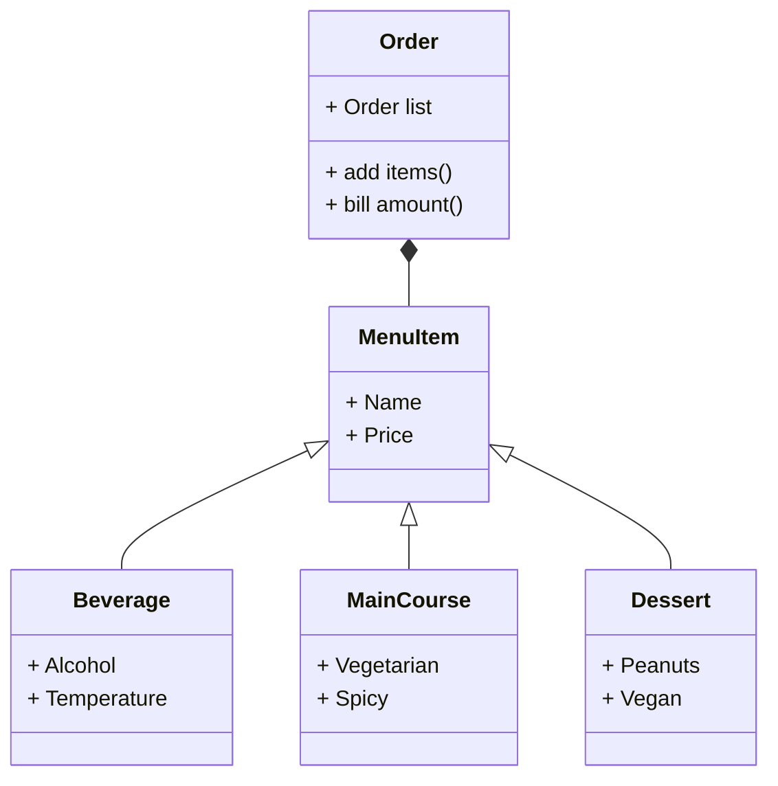

# Reto tres

## Punto uno
Hacer el ejercicio de la clase.

**Ejercicio**
1. Create class Line.
* length, slope, start, end: Instance attributes, two of them being points (so a line is composed at least of two points).
* compute_length(): should return the line´s length
* compute_slope(): should return the slope of the line from tje horizontal in deg.
* compute_horizontal_cross(): should return if exists the intersection with x-axis
* compute_vertical_cross(): should return if exists the intersection with y-axis
2. Redefine the class Rectangle, adding a new method of initialization using 4 Lines (composition at its best, a rectangle is compose of 4 lines).

**Código**
```

```
## Punto dos
**Restaurant scenario**

You want to design a program to calculate the bill for a customer's order in a restaurant.
* Define a base class MenuItem: This class should have attributes like name, price, and a method to calculate the total price.
* Create subclasses for different types of menu items: Inherit from MenuItem and define properties specific to each type (e.g., Beverage, Appetizer, MainCourse).
* Define an Order class: This class should have a list of MenuItem objects and methods to add items, calculate the total bill amount, and potentially apply specific discounts based on the order composition.
* Create a class diagram with all classes and their relationships. The menu should have at least 10 items.

The code should follow PEP8 rules.
**Código**
```

```
**Diagrama de clases**

